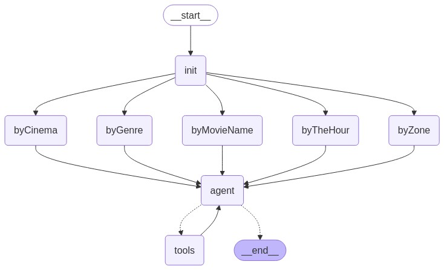

[Español](README_ES.md)

check quick demo
[CTRL & Click to watch quick Loom Demo](https://bit.ly/langgraph-ai-agent)

# 🎬 Movie Agent Chatbot for Guatemala City

An AI-powered chatbot designed to assist users in Guatemala City with movie listings, theater locations, and showtimes. Built as a teaching tool to demonstrate the integration of modern web development with LLM technologies.

## 1. 🧭 Project Setup

This project serves as educational material for a workshop aimed at developers venturing into LLM-powered web applications. It showcases the integration of technologies like LangChain, LangGraph, Anthropic/OpenAI LLM APIs, and MongoDB as vector storage, alongside a modern web development stack.

## 2. 🎯 Problem Statement

The chatbot addresses the need for a localized, intelligent assistant capable of:

- Providing movie listings for specific theaters.
- Identifying theaters showing a particular movie.
- Confirming if a specific movie is playing at a given theater.

The chatbot supports both Spanish and English queries, responding in the language of the query.

## 3. ⚠️ Considerations

- **Data Source**: Currently, data is sourced exclusively from the "Cinépolis" franchise, working to get more franchises soon.
- **Geographical Scope**: Information is limited to Guatemala City and its surroundings.
- **Data Freshness**: The system provides information for the current day only. A daily cron job seeds the necessary data.

## 4. 🛠️ Tech Stack

- **Frontend**: Next.js v15.x with React and TypeScript.
- **Backend**:
  - Node.js with TypeScript.
  - LangChain and LangGraph for LLM orchestration.
  - MongoDB as vector storage.
  - Prisma ORM with Prisma Accelerate for caching.
- **Monorepo**: Managed using TurboRepo, utilizing the `create-agent-chat-app` package from LangChain AI.

## 5. 🔍 Execution Details

- **Reasoning Model**: Utilizes the `Claude-Sonet-3.7` model for RAG chains and agent reasoning.
- **Tool Responses**: The chatbot displays tool responses for transparency. This feature can be toggled based on user preference.
- **Language Detection**: The system detects the language of the user's query and responds accordingly.

## 6. 📹 Demo

A Loom video demonstrating the chatbot's features and functionalities will be available soon.

## Agent Graph

